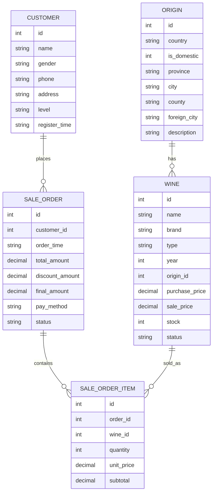

# Gold 红酒销售管理系统

## 项目简介

Gold 红酒销售管理系统是 Java 高级编程课程设计项目，采用控制台菜单形式实现红酒销售管理。系统支持红酒信息管理、产地管理、客户管理、购买结算、订单查询和销售统计，并使用 SQLite 数据库进行数据持久化。

## 技术栈

- Java 8
- Maven
- JDBC
- SQLite
- 控制台菜单程序

## 项目结构

```text
gold_wine_sales_management/
├── pom.xml
├── README.md
├── docs/
│   └── data/                  # 原始数据和数据来源说明
├── src/main/java/com/goldwine/
│   ├── Main.java              # 程序入口
│   ├── entity/                # 实体类
│   ├── dao/                   # 数据库访问层
│   ├── service/               # 业务逻辑层
│   ├── ui/                    # 控制台菜单
│   └── util/                  # 工具类
└── src/main/resources/data/   # 程序初始化种子数据
```

## 数据库设计

数据库文件：`wine.db`

程序首次启动时会自动创建数据库文件、数据表和演示数据。运行时数据库文件位于项目根目录，已通过 `.gitignore` 忽略。

| 表名 | 说明 |
| --- | --- |
| `origin` | 红酒产地表 |
| `wine` | 红酒信息表 |
| `customer` | 客户信息表 |
| `sale_order` | 销售订单主表 |
| `sale_order_item` | 销售订单明细表 |

## E-R 图



## 功能模块

1. 红酒信息管理：添加、修改、删除、查询、按名称查询、按类型查询、按产地查询、上架下架、库存不足查询。
2. 产地信息管理：添加、修改、删除、查询全部产地。
3. 客户信息管理：添加、修改、删除、查询、按姓名或电话查询、查询购买记录。
4. 购买结算管理：创建订单、会员折扣计算、库存扣减、取消订单并恢复库存。
5. 订单查询管理：查询全部订单、订单详情、客户订单、已完成订单、已取消订单。
6. 销售统计管理：时间段销售总额、红酒销量排行、单品销售情况、库存不足提醒、客户消费总额。

## 运行方法

确认本机已安装 JDK 8 或更高版本。项目已提交 Maven Wrapper，不需要单独安装 Maven。

Windows：

双击项目根目录下的：

```text
run.bat
```

如果需要恢复初始演示数据，可以先双击：

```text
reset-database.bat
```

它只会删除项目根目录下的本地运行数据库 `wine.db`，下次启动系统时会自动重新创建数据库并导入种子数据。

或在命令行执行：

```powershell
.\mvnw.cmd compile
.\mvnw.cmd exec:java
```

或使用封装脚本：

```powershell
.\scripts\compile.ps1
.\scripts\run.ps1
```

macOS / Linux：

```bash
./mvnw compile
./mvnw exec:java
```

也可以在 IDE 中打开 Maven 项目，直接运行：

```text
src/main/java/com/goldwine/Main.java
```

## 控制台菜单

```text
====== Gold 红酒销售管理系统 ======

1. 红酒信息管理
2. 产地信息管理
3. 客户信息管理
4. 购买结算管理
5. 订单查询管理
6. 销售统计管理
0. 退出系统
```

## 演示建议

1. 启动系统并展示主菜单。
2. 查询全部红酒，确认数据库初始化成功。
3. 添加一个产地和一条红酒信息。
4. 添加一个客户。
5. 创建购买订单，展示会员折扣和实付金额。
6. 查询红酒库存，展示库存自动扣减。
7. 查询订单详情。
8. 取消订单，展示库存恢复。
9. 查看销售统计和库存不足提醒。

## 数据说明

- 程序运行所需初始化数据位于 `src/main/resources/data/`。
- 原始数据、SQLite 脚本和数据来源说明归档在 `docs/data/`。
